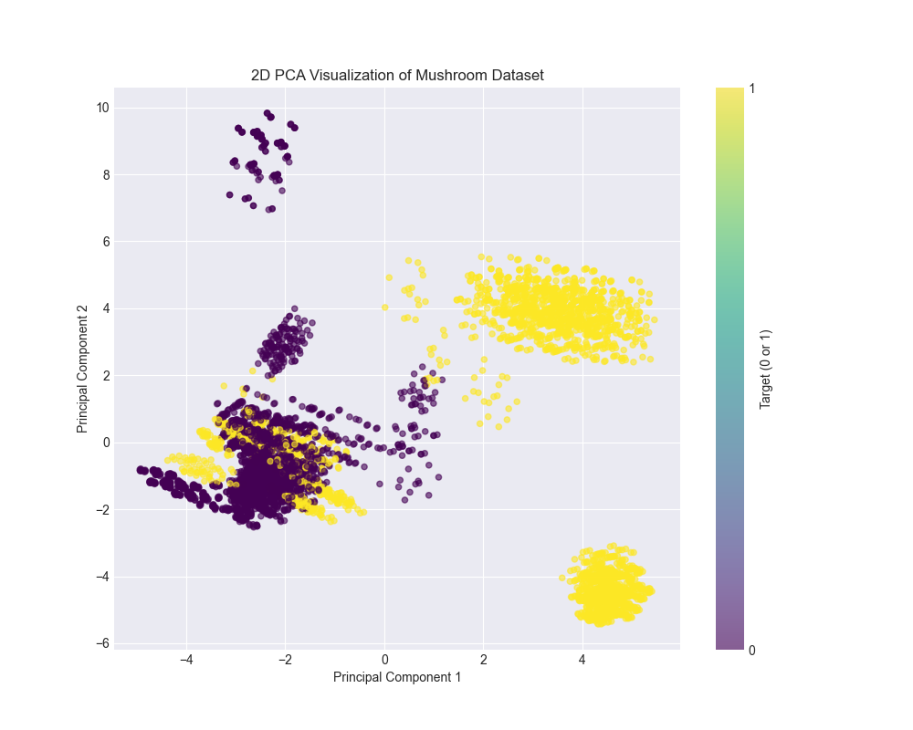
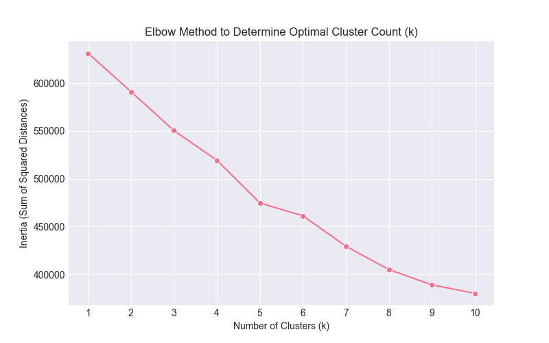

# Unsupervised Machine Learning Workshop

This repository contains a comprehensive unsupervised machine learning analysis of the mushroom dataset, including exploratory data analysis (EDA), dimensionality reduction, clustering, and supervised model experiments.

## 📁 Repository Structure

```
Unsupervised-Machine-Learning-Workshop/
├── data/
│   └── raw/                    # Raw dataset files
│       └── agaricus-lepiota.data
├── docs/                       # Documentation (Spanish and English)
├── notebooks/                  # Jupyter notebooks
│   ├── 01_data_exploration_and_eda.ipynb # Exploratory Data Analysis notebook
│   └── task.ipynb             # Main project task notebook
├── results/
│   ├── figures/               # Generated plots and visualizations
│   └── reports/               # CSV reports and summaries
└── README.md
```

## 🚀 Getting Started

### Prerequisites

- Python 3.8 or higher
- Git
- pip (Python package installer)

### Installation & Setup

#### 1. Clone the Repository

```bash
git clone https://github.com/buntynanwani/Unsupervised-Machine-Learning-Workshop.git
cd Unsupervised-Machine-Learning-Workshop
```

#### 2. Create a Virtual Environment

**On Windows:**
```bash
python -m venv venv
venv\Scripts\activate
```

**On macOS/Linux:**
```bash
python3 -m venv venv
source venv/bin/activate
```

#### 3. Install Required Packages

```bash
pip install -r requirements.txt
```


#### 4. Download the Dataset

**Note:** GitHub may not allow large dataset uploads. If the dataset is not included in the repository, download it manually:

1. Visit the [UCI Machine Learning Repository - Mushroom Dataset](https://archive.ics.uci.edu/dataset/73/mushroom)
2. Download the dataset
3. Place `agaricus-lepiota.data` in the `data/raw/` directory

#### 5. Launch Jupyter Notebook

```bash
jupyter notebook
```

Navigate to the `notebooks/` directory and open:
- `01_data_exploration_and_eda.ipynb` for exploratory data analysis
- `task.ipynb` for the complete project workflow

## 📊 Project Overview and Objectives

**Goal:** Explore and preprocess a categorical mushroom dataset, apply dimensionality reduction and clustering techniques, and evaluate ensemble models where a labeled target is present.

The notebook follows a reproducible pipeline:
```
Load CSV → Inspect → Clean/Impute → Encode/Scale → Reduce Dimension → Cluster/Fit Models → Save Reports and Figures
```

## 📝 Workflow Summary

### 1. Data Ingestion and Initial Inspection

- **Dataset:** `data/raw/agaricus-lepiota.data`
- **Initial checks:** Shape, head/tail/sample, dtypes, and memory usage
- **Analysis outputs:**
  - `results/reports/features_unique_values.csv` — unique values per feature
  - `results/reports/null_values_analysis.csv` — missing value analysis

**Observations:** All predictors are categorical codes (single-character tokens). Some columns have low cardinality; constant features are automatically removed.

### 2. Advanced Cleaning & Preprocessing

- **Missing value imputation:** Mode-based replacement for features like `e.1`
- **Feature removal:** Constant features (single unique value) dropped
- **Encoding:**
  - One-hot encoding applied to predictors using `pd.get_dummies()`
  - Target `p` label-encoded
- **Train/test split:** Stratified split (test_size=0.33, random_state=42)
- **Scaling:** `StandardScaler` applied before PCA and distance-sensitive models

**Outputs:**
- `results/reports/unique_values_analysis.csv`
- `results/reports/dataset_summary.csv`

### 3. Dimensionality Reduction (PCA) and Visualization

- **2D PCA visualization:** Retains ~2.24% variance, saved to `results/figures/pca_target_plot.png`



- **Variance retention analysis:** ~109 components needed for ~95% variance retention (from original ~116 variables)

**Implication:** Original features are largely non-redundant. While 2D PCA is useful for visualization, many components are required to preserve dataset information.

### 4. Clustering and Unsupervised Analysis

- **K-Means clustering:** Evaluated using elbow method (k=1..10)
- **Elbow plot:** `results/figures/kmeans_elbow_method.png`



- **K=2 clustering:** Trained on PCA-reduced data
- **Visualizations:**
  - `results/figures/kmeans_target_distribution.png`
  - `results/figures/pca_kmeans_clusters.png`


**Finding:** PCA visualizations show regions with strong separation between target classes and regions with significant mixing.

### 5. Supervised Modeling & Ensemble Methods

- **Random Forest classifier:** Trained on standardized features
  - **Test accuracy:** 1.0000 (100%)
  - Configuration: 100 trees, random_state=42
- **PCA-reduced model:** Random Forest retrained on 109 PCA components
  - Training time and accuracy compared

**Note:** Perfect accuracy may indicate strong feature signal or potential leakage. Further cross-validation and leakage checks recommended.

## 📂 Generated Artifacts

All outputs are saved in the `results/` directory:

### Reports (`results/reports/`)
- `features_unique_values.csv`
- `null_values_analysis.csv`
- `unique_values_analysis.csv`
- `dataset_summary.csv`

### Figures (`results/figures/`)
- `pca_target_plot.png`
- `cardinality_analysis.png`
- `kmeans_elbow_method.png`
- `kmeans_target_distribution.png`
- `pca_kmeans_clusters.png`

## 📚 Documentation

Detailed documentation is available in both Spanish and English:
- **Path:** `docs/`

## ✅ Competency Checklist

### Evaluate Datasets Using Data Analysis and Visualization Tools

- ✅ Use and management of .csv format
- ✅ Data cleaning and preprocessing
- ✅ Data visualization (Seaborn, Matplotlib, Plotly)
- ✅ Detailed exploratory data analysis (EDA)
- ✅ Preprocessing techniques (Label Encoding, One-Hot Encoding, StandardScaler)
- ✅ Advanced cleaning (mode imputation, low-information feature removal)
- ✅ Dimensionality reduction (PCA, t-SNE)

### Apply Machine Learning Algorithms According to the Problem

- ✅ Variable selection
- ✅ Recognize unsupervised case
- ✅ Apply clustering models (K-Means with elbow method)
- ✅ Identify regression/classification
- ✅ Train/test split (stratified)
- ✅ Use of ensemble models (RandomForest, supports GradientBoosting/AdaBoost)

## 🔧 Troubleshooting

### Dataset Not Found
If you encounter a "file not found" error, ensure the dataset is in the correct location:
```
Unsupervised-Machine-Learning-Workshop/data/raw/agaricus-lepiota.data
```

### Missing Dependencies
If you encounter import errors, install missing packages:
```bash
pip install package_name
```

### Virtual Environment Issues
If the virtual environment doesn't activate, ensure you're using the correct command for your operating system (see step 2 above).


## 📧 Contact

For questions or issues, please open an issue on GitHub my profile https://github.com/buntynanwani

---

**Note:** This project is for educational purposes as part of an Unsupervised Machine Learning Workshop.