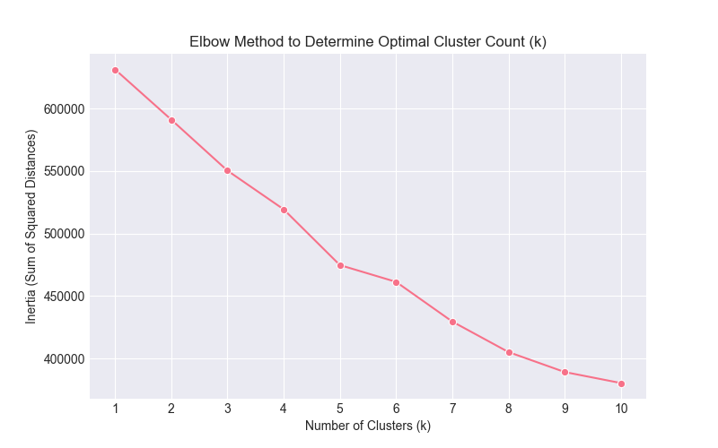
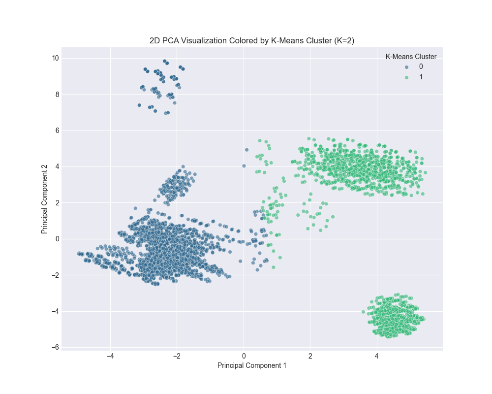

# Unsupervised Machine Learning Workshop — Report

This report summarizes the workflow, processing steps and key results from the `task.ipynb` notebook in this repository. The analysis uses the mushroom dataset (`data/raw/agaricus-lepiota.data`) and produces EDA artifacts, preprocessing steps, dimensionality reduction, clustering, and supervised model experiments. Outputs (CSV reports and figures) are saved under `results/reports/` and `results/figures/`.

## 1 — Overview and objective

Goal: explore and preprocess a categorical mushroom dataset, apply dimensionality reduction and clustering, and evaluate ensemble models where a labeled target is present.

The notebook follows a reproducible pipeline: load CSV → inspect → clean/impute → encode/scale → reduce dimension → cluster/fit models → save reports and figures.

## 2 — Data ingestion and initial inspection

- File used: `data/raw/agaricus-lepiota.data` loaded with `pandas.read_csv()`.
- Initial checks: dataset shape, head/tail/sample, dtypes and memory usage were printed.
- Unique-values analysis produced a two-column summary (`Feature`, `N_Unique_Values`) and was saved to `results/reports/features_unique_values.csv`.
- Missing-value and null analysis was performed and saved to `results/reports/null_values_analysis.csv`.

Observations: all predictors are categorical codes (single-character tokens). Some columns had low cardinality (binary or small sets); a few constant features were removed automatically.

## 3 — Advanced cleaning & preprocessing

- Missing value imputation: where appropriate (e.g., feature `e.1`), missing values were replaced using the mode.
- Constant features (single unique value) were dropped to reduce noise.
- One-hot encoding was applied to predictors using `pd.get_dummies()` to produce a fully numeric matrix for modeling; target `p` was label-encoded.
- Train/test split: a stratified split was used (test_size=0.33, random_state=42) to preserve class balance.

Scaling: `StandardScaler` was applied before PCA and before training distance-sensitive models.

Files produced: `results/reports/unique_values_analysis.csv`, `results/reports/dataset_summary.csv`.

## 4 — Dimensionality reduction (PCA) and visualization

- PCA was used to visualize data in 2D and to evaluate how many components are required to retain variance.
- 2-component visualization retained a small fraction of variance (notebook reports ~2.24% for the first two components). The explained variance for the 2 components was printed alongside a scatter visualization saved to `results/figures/pca_target_plot.png`.

- A full PCA run determined ~109 components were needed to retain ~95% of variance (i.e., original feature space of ~116 variables reduced to 109 components for ~95% variance retention). This indicates the original features are largely non-redundant.

Implication: while 2D PCA is useful for visualization and diagnosing separability, a much larger number of components is required to preserve most dataset information for modeling.

## 5 — Clustering and unsupervised analysis

- K-Means clustering was evaluated using the elbow method (inertia across k=1..10). The elbow plot is saved to `results/figures/kmeans_elbow_method.png`.

- KMeans with K=2 was trained on PCA-reduced data for visualization and comparison with the target variable; cluster-target distribution plots are saved to `results/figures/kmeans_target_distribution.png` and `results/figures/pca_kmeans_clusters.png`.

Finding: PCA visualizations show regions with strong separation between the two target classes, and regions with significant mixing — useful insights for model expectations.

## 6 — Supervised modeling & ensemble methods

- A Random Forest classifier was trained on the standardized features and evaluated on the held-out test set. The notebook reports a test accuracy of 1.0000 (100% accuracy) for the Random Forest (RandomForestClassifier with 100 trees, random_state=42).
- To test dimensionality reduction effects, Random Forest was retrained on PCA-reduced data (109 components) and the test accuracy recomputed. Training time and accuracy for the reduced-space model were printed and compared.

Notes: a perfect score can indicate either strong signal in features or potential leakage; the notebook uses stratified split and standard practices, but further cross-validation and careful leakage checks are recommended.

## 7 — Reproducible outputs

Primary artifacts created by the notebook:

- `results/reports/features_unique_values.csv`
- `results/reports/null_values_analysis.csv`
- `results/reports/unique_values_analysis.csv`
- `results/reports/dataset_summary.csv`
- `results/figures/pca_target_plot.png`
- `results/figures/cardinality_analysis.png`
- `results/figures/kmeans_elbow_method.png`
- `results/figures/kmeans_target_distribution.png`
- `results/figures/pca_kmeans_clusters.png`

These files enable inspection and reproduction of the EDA, preprocessing, PCA, clustering and model evaluation steps.

## 8 — Competency checklist (mapping)

Competency: Evaluate datasets using data analysis and visualization tools

- ✅ Use and management of .csv format — dataset read from CSV; multiple result CSVs written to `results/reports/`.
- ✅ Data cleaning and preprocessing — missing-value imputation, removal of constant features, and feature-wise inspection implemented.
- ✅ Data visualization (Seaborn, Matplotlib, Plotly) — visualizations saved and used for EDA and model diagnostics.
- ✅ Detailed exploratory data analysis (EDA) — head/tail/sample, dtype and memory checks, unique-value summaries, cardinality analysis.
- ✅ Preprocessing techniques — Label Encoding (target), One-Hot Encoding (predictors), StandardScaler for scaling before PCA and modeling.
- ✅ Advanced cleaning — mode imputation for missing entries, flagging/removal of low-information features.
- ✅ Dimensionality reduction — PCA used for 2D visualization and to determine component counts for variance retention; t-SNE may be applied as an optional visualization.

Competency: Apply machine learning algorithms according to the problem

- ✅ Variable selection — constant/near-constant features removed; low-information features flagged.
- ✅ Recognize unsupervised case — KMeans clustering applied and evaluated as an unsupervised approach.
- ✅ Apply clustering models — elbow method and KMeans training implemented and visualized.
- ✅ Identify regression/classification — target `p` encoded and classification pipeline used where appropriate.
- ✅ Train/test split — stratified split used to create training and testing sets.
- ✅ Use of ensemble models — RandomForest implemented; pipeline supports GradientBoosting/AdaBoost and other ensembles.

